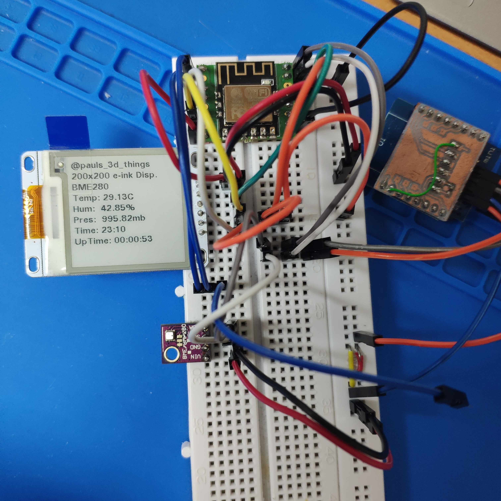

# An esp8285m3 based smartwatch

... or what ever this will be.

Update: [VIDEO](https://www.instagram.com/p/BmUH-vqA_Hz/?taken-by=pauls_3d_things)

## Initial Breadboard Tests:

What works:

- 200x200 E-Ink
- BME280
- ESP8285-M3
- Time from the internet via Webtime.h
- Time/UpTime-keeping via RTC




## Partial refresh: tuning the u8g2 lib for redraw performance
Use the following LUT in `u8x8_d_ssd1607_200x200.c`, starting at line *306*. It has less flickering
```c
/* orginal values without 0-0 and 1-1 transition */
  
  U8X8_A(L(3,0,0,3)), // 0x02
  U8X8_A(L(3,0,0,3)), // 0x02
  U8X8_A(L(3,0,0,3)), // 0x01
  U8X8_A(L(3,1,0,3)), // 0x11
  U8X8_A(L(3,1,0,3)), // 0x12
  U8X8_A(L(3,1,0,3)), // 0x12
  U8X8_A(L(3,2,0,3)), // 0x22
  U8X8_A(L(3,2,0,3)), // 0x22
  U8X8_A(L(3,2,1,3)), // 0x66
  U8X8_A(L(3,2,2,3)), // 0x69
  U8X8_A(L(3,2,2,3)), // 0x69
  U8X8_A(L(3,1,2,3)), // 0x59
  U8X8_A(L(3,1,2,3)), // 0x58
  U8X8_A(L(3,1,2,3)), // 0x99
  U8X8_A(L(3,1,2,3)), // 0x99
  U8X8_A(L(3,0,2,3)), // 0x88
  U8X8_A(L(3,0,0,3)), // 0x00
  U8X8_A(L(3,0,0,3)), // 0x00
  U8X8_A(L(3,0,0,3)), // 0x00
  U8X8_A(L(3,0,0,3)), // 0x00
```
Also, we speedup initialization by calling `u8g2.initDisplay();` instead of `u8g2.begin()`;
And, by disabling the line 370 with a comment: `// u8x8_d_ssd1607_200x200_first_init(u8x8);`