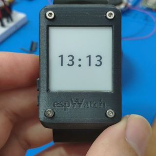
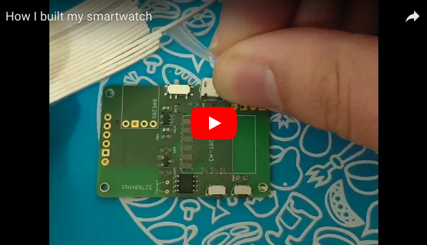
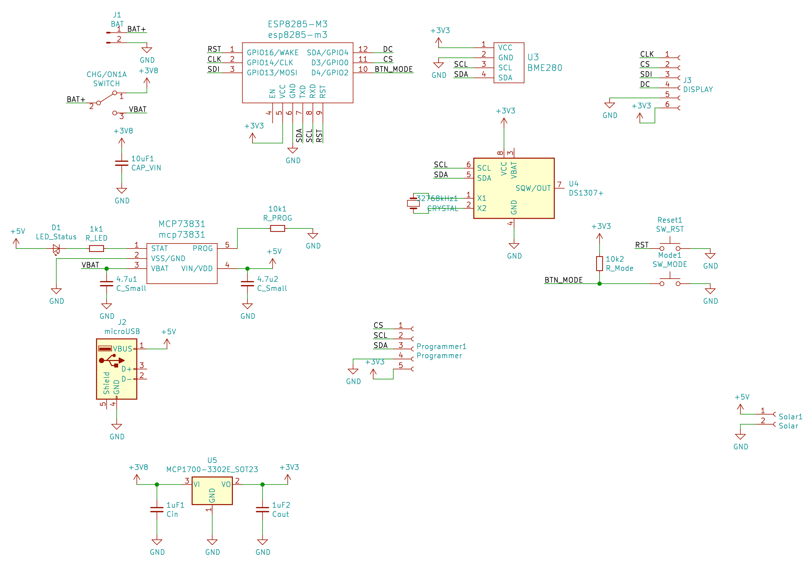
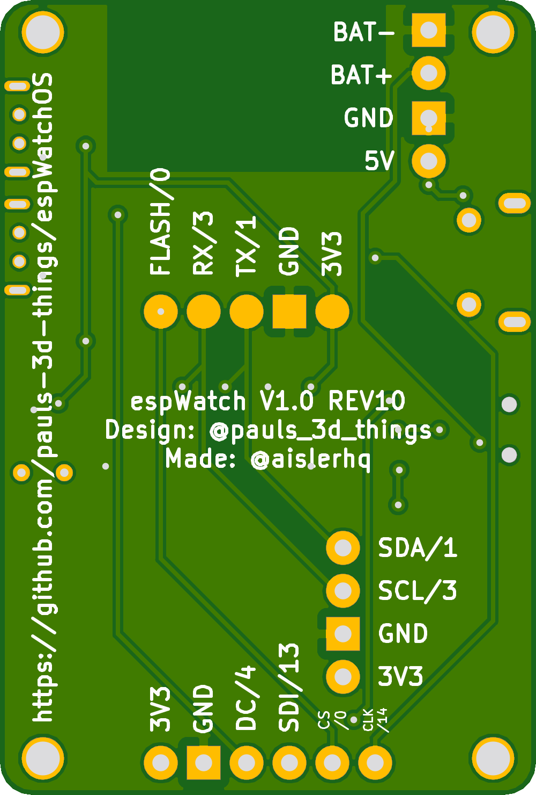
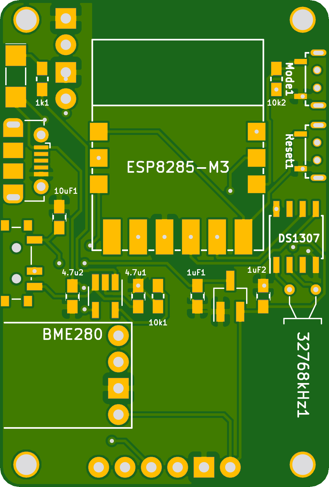

# A DIY Smartwatch

Ok, we can argue about the smart part, but let's call it that way ;).

The goal of this project is to build a DIY smartwatch (with WiFi + Sensors) that runs for a month. Key is to use an e-ink display (like a Kindle) and lots of deepsleep.

It is mainly based on

- a 3D printed case (PLA) and wristband (TPU)
- an ESP8285-M3 module
- an e-ink display
- a BME280 environment sensor
- a DS1307 for time keeping
- a custom PCB + additional parts for power and charging

The software/firmware is under `code`, using the platformio framework to build. It currently is in **ALPHA** which means I'm playing around with adding features and functionality. The basic functionality of different watchfaces and refreshing every minute works, as well as sensor data and charts work 👍. An initial case already works, but might need further updates.

Everything else is still TODO. I am developing this in my spare time, so documentation is incomplete.

Click on the image below for a demo (there are more videos on my [Instagram](https://www.instagram.com/pauls_3d_things/)):

<a href="https://www.instagram.com/p/Bm8KqZFgRCe/?taken-by=pauls_3d_things"></a>

## Required Parts
If you want to join this project and help developing the hardware + code, these are the links I used for ordering. You can contact me via instagram to check if there are free PCBs ;).

- PCB [https://aisler.net/uvwxy/pauls-3d-things/esp-watch](https://aisler.net/uvwxy/pauls-3d-things/esp-watch) (You can solder this manually, but I highly recommend using a stencil, and a hot air gun)
- 1x [Switch](https://de.aliexpress.com/item/50Pcs-Mini-7-Pin-On-Off-1P2T-SPDT-MSK-12C02-SMD-Toggle-Slide-Switch-For-MP3/32856542440.html?spm=a2g0s.9042311.0.0.38954c4d0YC1Ol)
- 2x [Buttons](https://de.aliexpress.com/item/50-St-cke-2x4x3-5mm-SMT-SMD-Tact-Taktile-Druckschalter-SMD-Oberfl-chenmontage-Momentary-MP3-MP4/32870278366.html?spm=a2g0s.9042311.0.0.38954c4d0YC1Ol)
- 1x 4x30x35mm [LiPo](https://de.aliexpress.com/store/product/3-7V-450mAh-403035-Lithium-Polymer-Li-Po-li-ion-Rechargeable-Battery-cells-For-Mp3-MP4/1019877_32784983931.html?spm=a2g0x.search0104.3.1.14501d9fy0Fy3i&ws_ab_test=searchweb0_0,searchweb201602_2_10320_10065_10068_10843_10547_5014915_10059_10548_100031_10696_10319_10084_10083_10103_451_5014815_452_10618_10304_10307_10820_10821_10302_5014715_5014615,searchweb201603_54,ppcSwitch_4&algo_expid=2f37b1d9-6cae-44f2-8b9a-b8dce6273785-0&algo_pvid=2f37b1d9-6cae-44f2-8b9a-b8dce6273785&priceBeautifyAB=0)
- 1x [micro USB Connector](https://de.aliexpress.com/item/20pcs-High-Quality-Micro-USB-Type-B-Female-5-Pin-SMT-Placement-SMD-DIP-Socket-Connector/32782798189.html?spm=a2g0s.9042311.0.0.27424c4dAA0igt)
- 1x [ESP8285-M3](https://de.aliexpress.com/item/Mini-Ultra-Small-Size-ESP-M3-From-ESP8285-Serial-Wireless-WiFi-Transmission-Module-Fully-Compatible-With/32846843421.html?spm=a2g0s.9042311.0.0.27424c4dAA0igt)
- 1x [200x200pix e-ink Display](https://de.aliexpress.com/item/1-54-Inch-E-Paper-Module-E-Ink-Display-Screen-Module-Black-White-Color-SPI-Support/32846836344.html?spm=a2g0s.9042311.0.0.27424c4d1uskWf)
- 1x [BME280](https://de.aliexpress.com/item/Hohe-Genauigkeit-BME280-Digital-Sensor-Temperatur-Luftfeuchtigkeit-Luftdruck-Sensor-Modul-GY-BME280-I2C-SPI-1-8/32672210336.html?spm=a2g0s.9042311.0.0.27424c4dbxRhPL)
- 1x [DS1307](https://de.aliexpress.com/store/product/2-St-cke-I2C-IIC-RTC-DS1307-At24c32-Echtzeituhr-modul-F-r-Arduino-AVR-51-ARM/1414081_32834913817.html?spm=a2g0x.12010615.8148356.7.44b3290dHOyVcj) (I desoldered the ds1307 and oscillator from the board)
- 1x [3.3V LDO - MCP1700](https://de.aliexpress.com/item/50PCS-MCP1700T-3302E-TT-MCP1700-LDO-3-3V-0-25A-SOT23-3-New-Original/32818247351.html?spm=a2g0s.9042311.0.0.27424c4d81rZFo)
- 1x [LiPo Charger - MCP73831](https://de.aliexpress.com/item/20PCS-MCP73831T-2DCI-OT-MCP73831T-MCP73831-SOT23-5/32249741618.html?spm=a2g0s.9042311.0.0.27424c4d81rZFo)
- SMD 0603 capacitors and resistors (1k, 2x10k), (2x1uF, 2x4.7uF, 1x10uF)
- 1x [SMD 1206 LED](https://de.aliexpress.com/item/500-pieces-lot-1206-SMD-White-Red-Blue-Green-Yellow-20pcs-each-Super-Bright-1206/32381504337.html?spm=a2g0s.9042311.0.0.27424c4diowaNx)

## Known Issues

PCB REV.10:

- the button footprints have been updated, they might fit now
- the pins 4+5 on the usb footprint are corrected

## How I built it

<a href="https://youtu.be/Sn--Rn5TsQE"></a>

## Details

### Schematics

I know the schematics can be cleaned up. I haven't spent that much time with KiCad, so if you have advice, please let me know. The same goes for the PCBs.

<a href="images/schematic.png"></a>

### PCB



## Experiments/Notes

### Partial refresh: tuning the u8g2 lib for redraw performance
Use the following LUT in `u8x8_d_ssd1607_200x200.c`, starting at line *306*. It has less flickering
```c
/* orginal values without 0-0 and 1-1 transition */
  
  U8X8_A(L(3,0,0,3)), // 0x02
  U8X8_A(L(3,0,0,3)), // 0x02
  U8X8_A(L(3,0,0,3)), // 0x01
  U8X8_A(L(3,1,0,3)), // 0x11
  U8X8_A(L(3,1,0,3)), // 0x12
  U8X8_A(L(3,1,0,3)), // 0x12
  U8X8_A(L(3,2,0,3)), // 0x22
  U8X8_A(L(3,2,0,3)), // 0x22
  U8X8_A(L(3,2,1,3)), // 0x66
  U8X8_A(L(3,2,2,3)), // 0x69
  U8X8_A(L(3,2,2,3)), // 0x69
  U8X8_A(L(3,1,2,3)), // 0x59
  U8X8_A(L(3,1,2,3)), // 0x58
  U8X8_A(L(3,1,2,3)), // 0x99
  U8X8_A(L(3,1,2,3)), // 0x99
  U8X8_A(L(3,0,2,3)), // 0x88
  U8X8_A(L(3,0,0,3)), // 0x00
  U8X8_A(L(3,0,0,3)), // 0x00
  U8X8_A(L(3,0,0,3)), // 0x00
  U8X8_A(L(3,0,0,3)), // 0x00
```
Also, we speedup initialization by calling `u8g2.initDisplay();` instead of `u8g2.begin()`;
And, by disabling the line 370 with a comment: `// u8x8_d_ssd1607_200x200_first_init(u8x8);`